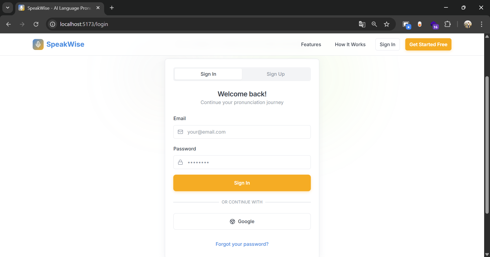

# SpeakWise Frontend

A modern web application for learning through voice and speech recognition, built with React, TypeScript, and Tailwind CSS.

## Project Overview

SpeakWise's frontend is a responsive and user-friendly interface that helps users practice and improve their language skills through voice interaction. The application features a clean design with both light and dark modes, and provides real-time feedback on user performance.

## Tech Stack

- **React** - Frontend library
- **TypeScript** - Type-safe JavaScript
- **Tailwind CSS** - Utility-first CSS framework
- **Shadcn/ui** - Reusable component library
- **React Router** - Client-side routing
- **Vite** - Build tool and development server

## Project Structure

```
frontend/
├── src/
│   ├── assets/          # Static assets (images, icons)
│   ├── components/      # Reusable React components
│   │   ├── ui/         # Shadcn UI components
│   │   └── ...         # Custom components
│   ├── hooks/          # Custom React hooks
│   ├── lib/            # Utility functions and helpers
│   ├── pages/          # Page components
│   ├── App.tsx         # Root component
│   └── main.tsx        # Entry point
├── public/             # Public assets
└── package.json        # Project dependencies
```

## Key Features

- **Authentication System**: Secure user authentication and authorization
- **Dashboard**: Personal progress tracking and learning statistics
- **Practice Interface**: Interactive voice-based learning exercises
- **Progress Tracking**: Visual representation of learning progress
- **Responsive Design**: Works seamlessly on desktop and mobile devices

## Design System

The application uses a consistent design system with:

- Custom UI components built with Shadcn/ui
- Responsive layouts using Tailwind CSS
- Consistent typography and spacing
- Accessible components following WCAG guidelines

## State Management

- Local state management using React hooks
- Persistent storage for user preferences

## Performance Features

- Vite-powered development with HMR (Hot Module Replacement)
- Code splitting for optimal load times
- Asset optimization
- Lazy loading of components
- Efficient routing system

## Screenshots

Screenshots of the application can be found in the `docs/screenshots` directory. For convenience, a gallery of the current screenshots is embedded below so team members and contributors can preview key screens without opening the folder.


### User screens


*Landing page with hero section and call-to-action.*


*Sign up form / onboarding flow.*


*Sign in / authentication screen.*


*Features page highlighting app capabilities.*


*How it works / user flow explanation.*


*Footer section example with links and copyright.*


### Dashboard


*Dashboard — main overview, widgets and stats.*


*Dashboard — alternate view with detailed panels.*


*Progress — user progress visualization and charts.*


*Progress — another view of progress tracking.*


*Practice — interactive practice interface with voice input.*


*Feedback — example of feedback provided after a practice session.*


*Feedback — score breakdown and suggestions.*


*Feedback — detailed corrections and tips.*

### Admin


*Admin — main admin dashboard overview.*


*Admin — alternate dashboard / overview.*


*Admin — manage users and roles.*


*Admin — add/edit/remove phrases used in exercises.*


*Admin — form to add a new phrase.*


*Admin — profile and settings page.*


*Admin — alternate profile/settings view.*


*Admin — reports and analytics view.*
